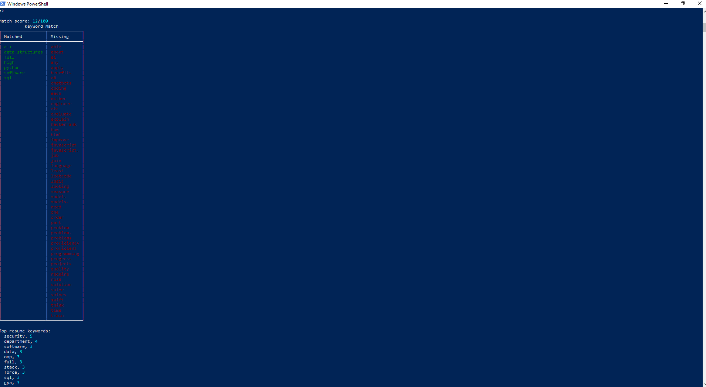

# Resume Matcher (Python Command Line Interface Tool)

Command line Python application that extracts keywords from resumes and job descriptions, scores how closely they align, and generates a report of matched and missing keywords.

## Features
- Parses the resume's PDF text
- Parses job description text
- Extracts and normalizes keywords
- Calculates a match score
- Displays matched vs missing keywords
- Shows top keyword frequency 

## How to Run

From terminal:

python -m resume_matcher.cli match "resume.pdf" --jd-file "job_description.txt"

Example output:
- Match score
- Matched keywords
- Missing keywords
- Top resume keywords
- Top job description keywords

## Tech Used
Python  
CLI (argparse)  
Text processing  
Keyword scoring logic  

## Purpose
Built as a portfolio project to demonstrate real world Python development and to automate the process of tailoring my resumes for job listings with some text processing and job search tools.

## Example Output

